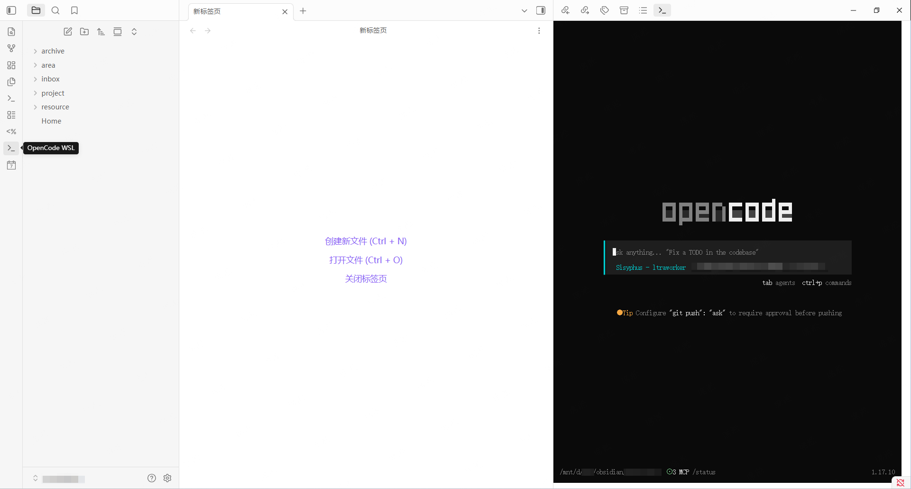

# OpenCode WSL — Obsidian Plugin

Embed [OpenCode](https://github.com/opencode-ai/opencode) TUI in the Obsidian sidebar via a lightweight WebSocket bridge to WSL.

## Demo



## Features

- **OpenCode TUI in Obsidian sidebar** — no separate terminal window needed
- **Auto-start bridge** — bridge server starts when you open the sidebar, stops when Obsidian closes
- **Full keyboard passthrough** — Ctrl+D, Ctrl+R, arrows, and all terminal shortcuts work (no Obsidian hotkey interception)
- **Settings panel** — font size, reconnect delay, scrollback buffer, WSL distribution, and more
- **Auto-reconnect** — seamlessly reconnects if the bridge is temporarily unavailable
- **Health check** — auto-restarts the bridge if it crashes
- **Theme-aware** — matches Obsidian's light/dark theme

## Architecture

```
Obsidian (Windows)                    WSL (Linux)
┌─────────────────────┐              ┌──────────────────────┐
│  xterm.js Terminal  │ ← WebSocket →│  Bridge Server       │
│  + FitAddon         │  127.0.0.1   │  (node-pty + ws)     │
│  + CanvasAddon      │              │  spawns opencode TUI │
└─────────────────────┘              └──────────────────────┘
```

## Requirements

- **Windows 10/11** with [WSL2](https://learn.microsoft.com/en-us/windows/wsl/install) installed
- **Node.js** installed inside WSL (for the bridge server)
- **OpenCode CLI** installed inside WSL (`curl -fsSL https://get.opencode.com | bash`)
- **Obsidian** v1.7.2+

## Installation

### From Obsidian Community Plugins (once published)

1. Settings → Community plugins → Browse
2. Search "OpenCode WSL"
3. Install & Enable

### Manual (BRAT / development)

1. Download the latest release from GitHub
2. Extract to `<vault>/.obsidian/plugins/opencode-wsl/`
3. Enable the plugin in Settings → Community plugins

## Usage

1. Click the terminal icon in the left ribbon, or run `OpenCode: Toggle WSL Terminal` from the command palette
2. The bridge server auto-starts inside WSL
3. OpenCode TUI appears in the right sidebar
4. Use OpenCode as you normally would in a terminal

### Settings

| Setting | Default | Description |
|---------|---------|-------------|
| Bridge port | 8765 | WebSocket port for the WSL bridge server |
| Working directory (WSL path) | auto-detected | Default working directory inside WSL |
| WSL distribution | (default) | Leave empty to use the default WSL distro |
| Terminal font size | 14 | Font size for the terminal |
| Terminal font family | MesloLGS NF, JetBrains Mono, ... | Font family for the terminal |
| Reconnect delay | 2000ms | Milliseconds to wait before reconnecting on disconnect |
| Scrollback buffer | 10000 | Number of lines to keep in scrollback |
| Node command | node | Node.js command used inside WSL |

## Development

```bash
# Clone the repo
git clone https://github.com/your-github-username/obsidian-opencode-wsl.git
cd obsidian-opencode-wsl

# Install dependencies
npm install

# Build the plugin (main.js + bridge.js)
npm run build

# Development mode (watch + rebuild)
npm run dev
```

### Bridge server (standalone)

The bridge server can also be run directly inside WSL for testing:

```bash
node bridge.js --port 8765 --dir /path/to/working/dir
```

## Related

- [OpenCode](https://github.com/opencode-ai/opencode) — The AI-powered terminal
- [obsidian-opencode](https://github.com/kriss-spy/obsidian-opencode) — Original Obsidian OpenCode plugin (Linux-only, different architecture)

## License

MIT